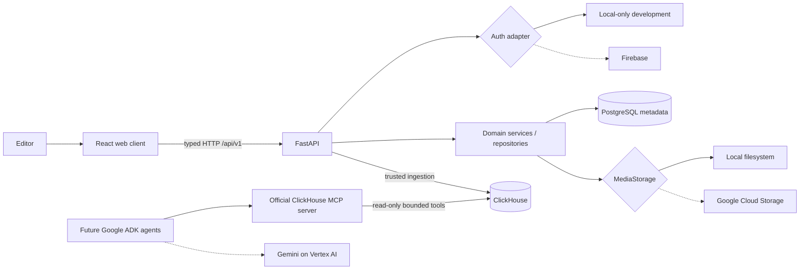

# EchoCut architecture

## System view

## Boundaries and data flows

The frontend owns presentation and form validation, not authorization or persistence. TanStack Query makes the API the source of truth, so refreshes reload PostgreSQL-backed state. Transport schemas are separate from SQLAlchemy records.

Operational metadata flows through `ProjectRepository`. Ownership is present in every project lookup; unauthorized and missing resources both return 404 to avoid leaking project existence. The Phase 1 PostgreSQL implementation is deliberately behind repository behavior so a Firestore repository can be added without changing routes or domain rules.

Phase 2 media flows through `MediaStorage` after route-level ownership and service-level type/size/duration checks. Metadata stores a SHA-256 checksum and private storage URI; raw file content is excluded from logs and API responses. `ExtractionJobRecord` captures provider, model and prompt provenance. `ExtractionDocumentRecord` stores schema-validated review data and becomes immutable after a named user approves it.

Trusted application ingestion writes safe structured events to ClickHouse. Agent analytical reads take the separate MCP path. `ProcessTransport` speaks MCP's stdio JSON-RPC transport and calls a bounded named tool; browser-provided SQL is impossible. MCP traces contain safe arguments and identifiers, never raw screenplay/transcript content.

## Authentication and storage

`AUTH_MODE=development` produces a visibly local-only identity. `AUTH_MODE=firebase` verifies bearer tokens via the Firebase Admin adapter and requires a project identifier. Production rejects development auth unless explicitly allowed.

`MediaStorage` has local filesystem and GCS implementations. Central validation enforces supported MIME types, size limits, basename extraction and filename sanitisation. Phase 2 will add project-scoped object keys and signed upload sessions.

## Future Gemini and ADK insertion points

Google ADK will orchestrate a typed directed workflow after extraction review. Gemini document/video tools will write validated extraction objects; deterministic audience-state stages will write events through trusted ingestion; diagnosis agents will query ClickHouse only through approved MCP tools. Media content is always untrusted input and cannot select tools.

The current `GeminiExtractionAdapter` consumes a transport interface and validates every response as `ExtractionContent`. A fake transport proves the contract. The local adapter never reads uploaded contents and marks its limitations explicitly; the production Vertex transport remains disabled until cloud runtime configuration is supplied.

## Major decisions

- Standalone `echocut/` directory preserves the unrelated repository already in the workspace.
- PostgreSQL follows the Phase 1 prompt, while the PDF's Firestore deployment direction remains a repository adapter target.
- ClickHouse is not the operational CRUD database; it is time-series analytical memory.
- MCP failure is visible (`not_configured`, `unavailable`, `degraded`) rather than hidden behind a fake success.
- Exactly Cut A and Cut B are allowed, enforced by validation, service behavior and a database uniqueness constraint.
- Synchronous SQLAlchemy is used behind small FastAPI dependencies for Phase 1 reliability; long-running Phase 2 jobs will be asynchronous records, not open requests.

## Threat model

| Risk | Current boundary |
|---|---|
| Unreleased film privacy | Project ownership checks, private storage abstraction, no raw media logging |
| Prompt injection | Future scripts/subtitles treated as data; workflow code controls tool selection |
| MCP misuse | Read-only credentials, bounded named tools, timeouts, trace audit, no frontend SQL |
| Cross-project access | Owner-filtered repositories for every project-scoped route |
| Secret leakage | Environment configuration, sanitised errors/logs, credential files ignored |
| Unsafe filenames | Basename reduction, character allowlist and length cap |
| Oversized uploads | Central MIME and 500 MiB size validation; stricter five-minute checks arrive with upload metadata |

## Deployment direction

The container topology maps to Cloud Run (web/API), Firebase/Firestore, GCS, Vertex AI/ADK and ClickHouse Cloud. Secrets move to Secret Manager. Production will use independent service identities and a dedicated read-only ClickHouse MCP user.
